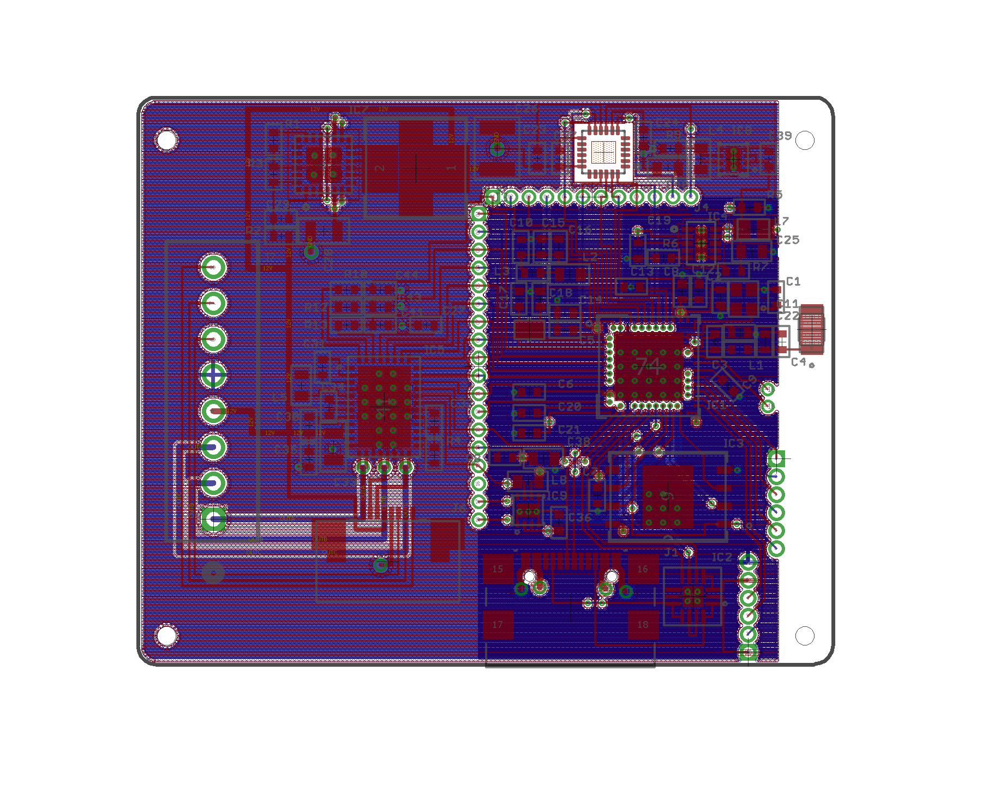

# MotorDrive						   
>Design: Motor Driver with Bluetooth 		   
>Engineer: Cy Drollinger								   
>Date: 6/25											           
>Email: cydrollinger@gmail.com 
**PURPOSE:** 
Eagle Cadsoft 7v7 complete project in an file architecture possible to plug and play as if the design was created local to the download location. Read CONTRIBUTING.md for access to CAD program.  
**SCHMATIC:** 

**BOARD:**

**TECHNOLOGIES:** 
GCT: <a href="https://gct.co/connector/usb4110"  target="_blank">USBC connector</a>  
OnSemi: <a href="https://www.onsemi.com/products/interfaces/usb-type-c/fusb302b" target="_blank">USBC Controller</a> 
NordicSemiconductor: <a href="https://www.nordicsemi.com/Products/nRF52840" target="_blank">nRF52840</a>  
Texas Instrument: <a href="https://www.ti.com/product/DRV8316?keyMatch=DRV8316&tisearch=universal_search&usecase=GPN-ALT" target="_blank">DRV8316</a>  
TDK: <a href="https://product.tdk.com/en/search/sensor/mortion-inertial/imu/info?part_no=ICM-20948" target="_blank">ICM-20948</a> 
Analog Devices: <a href="https://www.analog.com/en/products/lt8640.html" target="_blank">LT8640</a>  
**LICENSES:** 
OPEN